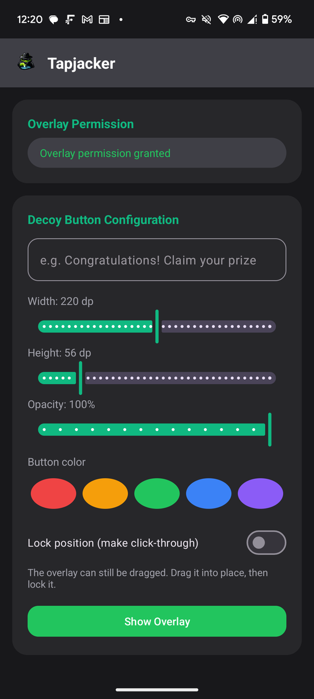
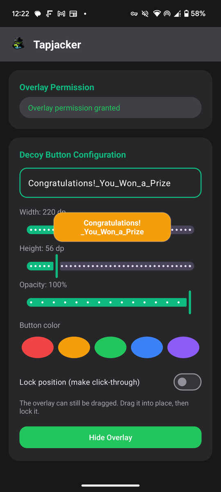
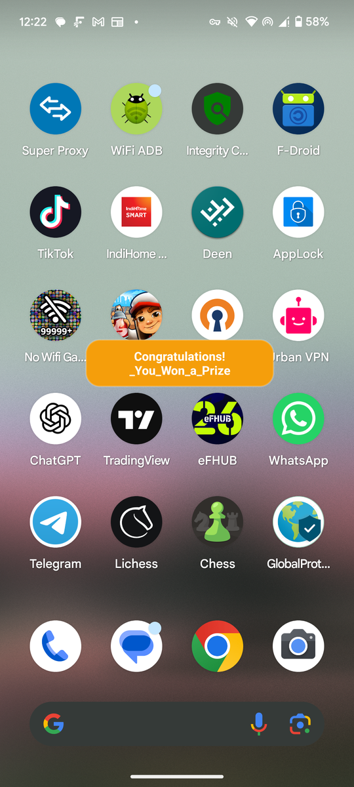

<div align="center">
  

  # Tapjacker

  A hands-on Android demo of **tapjacking** (UI redressing): configure a floating decoy
  button, drag it into place, lock it, and watch taps pass straight through to whatever
  is underneath — the same technique real overlay attacks rely on.
</div>

<br>

<table>
<tr>
<td width="33%"></td>
<td width="33%"></td>
<td width="33%"></td>
</tr>
<tr>
<td align="center"><sub>Configuration screen</sub></td>
<td align="center"><sub>Decoy overlay floating over the app</sub></td>
<td align="center"><sub>Overlay floats above <em>any</em> app, even the home screen</sub></td>
</tr>
</table>

## What this is

Tapjacking abuses Android's "display over other apps" permission
(`SYSTEM_ALERT_WINDOW`) to draw a decoy on top of a victim app's real UI. Once
positioned, the overlay is marked **not touchable**
(`WindowManager.LayoutParams.FLAG_NOT_TOUCHABLE`), so the system stops delivering
touches to it and routes them straight to whatever window is underneath instead. The
user sees the decoy but the tap lands on the real control behind it.

This app lets you *reproduce that effect on your own device*, safely and visibly:

- **Configurable decoy button** — custom text, width/height, opacity, and color.
- **Freely draggable** — position the decoy exactly where you want it.
- **Lock = click-through** — locking the position doesn't just freeze it, it flips on
  `FLAG_NOT_TOUCHABLE`, turning the decoy into a pure visual disguise. Taps on it are
  delivered to the app/window behind it, not to the decoy.
- **Works system-wide** — since it's a real overlay window, it floats above any app,
  including the home screen, exactly like a real overlay attack would.

For the full technical breakdown — window flags, the drag implementation, the
service/activity binder plumbing, and why this only works reliably against a
*different* app rather than itself — see the code walkthrough in
[`OverlayService.java`](app/src/main/java/com/boltz/tapjacker/OverlayService.java).

## Features

| | |
|---|---|
| 🎨 Custom decoy text | Type anything — "Claim your prize", "Continue", etc. |
| 📏 Adjustable size | Independent width/height sliders (dp) |
| 🌓 Adjustable opacity | 30–100% |
| 🎨 5 preset colors | Red, orange, green, blue, purple |
| 🖐️ Drag to position | Freely move the overlay while unlocked |
| 🔒 Lock = click-through | Locks position **and** makes the overlay pass touches through to whatever is beneath it |
| 🌙 Dark UI | Fixed dark theme, not tied to system light/dark setting |

## Requirements

- Android 7.0 (API 24) or higher
- "Display over other apps" permission (requested in-app; Android will not grant this
  at install time)

## Building

```bash
git clone https://github.com/bolt-11/tapjacker.git
cd tapjacker
./gradlew assembleDebug
```

The debug APK will be at `app/build/outputs/apk/debug/app-debug.apk`. Alternatively,
grab a prebuilt APK from the [Releases](../../releases) page.

## Responsible use

This project exists to help understand and test for overlay-based UI redressing. Use
it only on devices and apps you own or are explicitly authorized to test. Do not use
this technique against third-party apps or users without consent.
